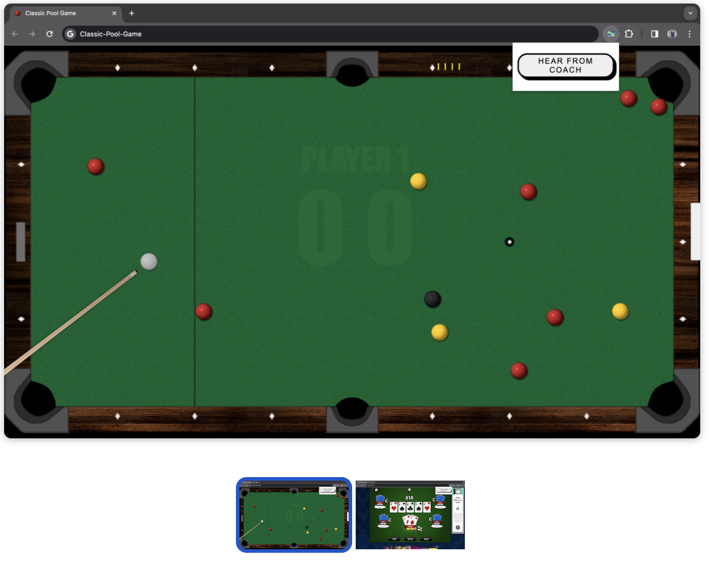

# VoiceOver Coach (VO Coach) for Favorite Games

## Overview

VO Coach for Favorite Games is an innovative voice assistant designed to enhance your gaming experience. It provides real-time coaching and tips while you play your favorite games. This project showcases how AI can be seamlessly integrated into gaming to offer valuable assistance and improve gameplay.

## Demonstration Video

Watch the demonstration video of our AI Voice Coach to see how it works in real-time. This video provides an overview of the main features and functionalities, showcasing the seamless interaction between the AI and users.

<video width="640" height="480" controls>
  <source src="videos/AI%20Voice%20Coach%20-%20XGaming.mp4" type="video/mp4">
  Your browser does not support the video tag.
</video>

## Features

- Real-time voice coaching
- AI-driven insights and tips
- Seamless integration with various games
- User-friendly interface

## Screenshots

### Classic Pool Game

Experience real-time coaching while playing classic pool. The AI provides tips and strategies to improve your gameplay.

##Installation
You can get the VO Coach from this link https://chromewebstore.google.com/detail/vo-coach-for-favorite-gam/eaadfgpaknlhoeeiccfjhmlpblechjob
